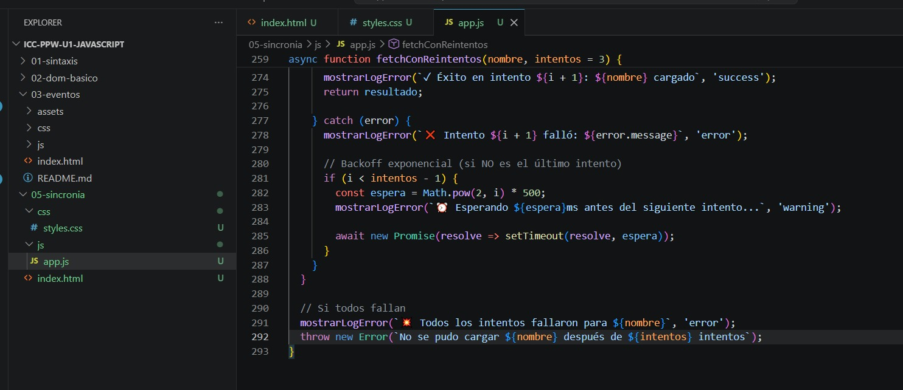
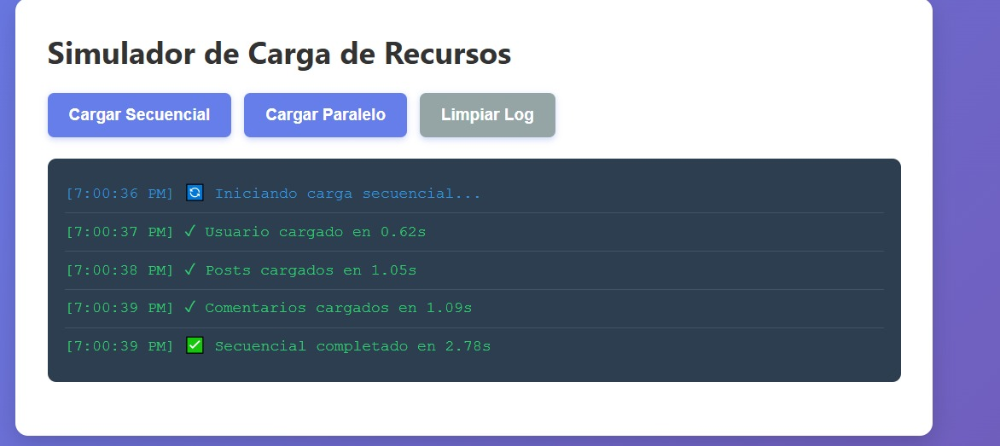
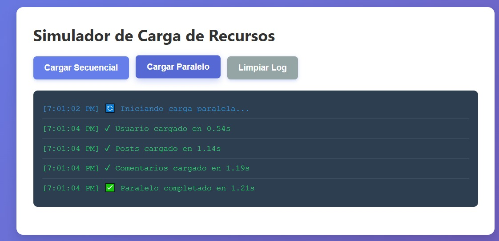
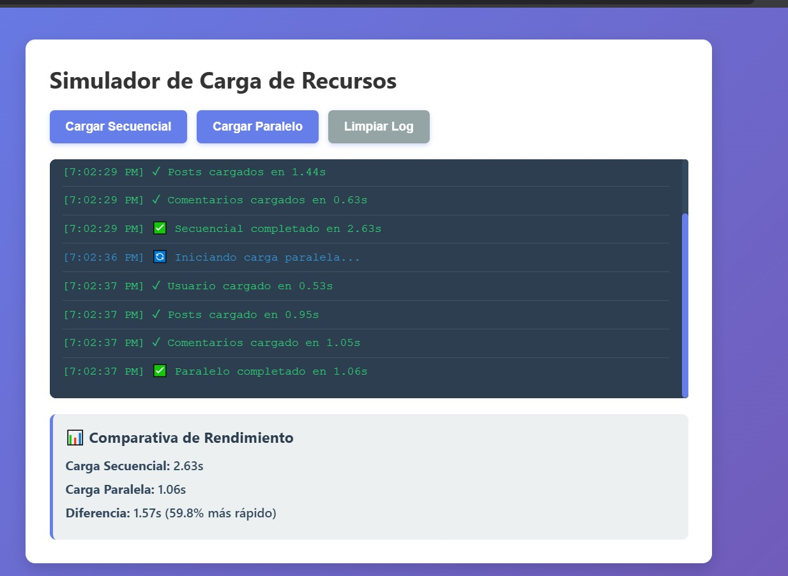
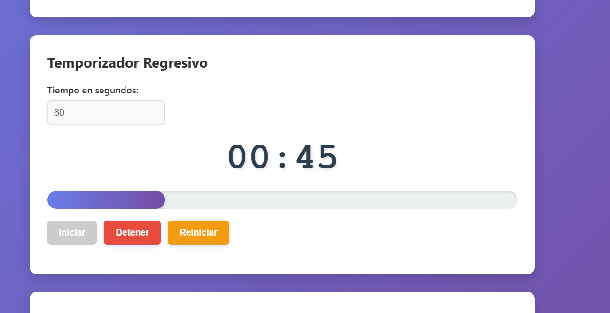
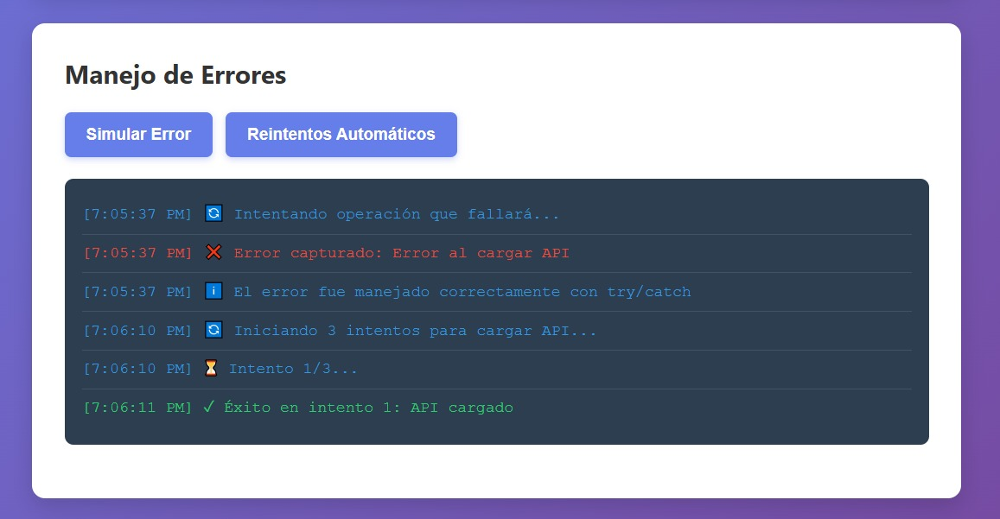
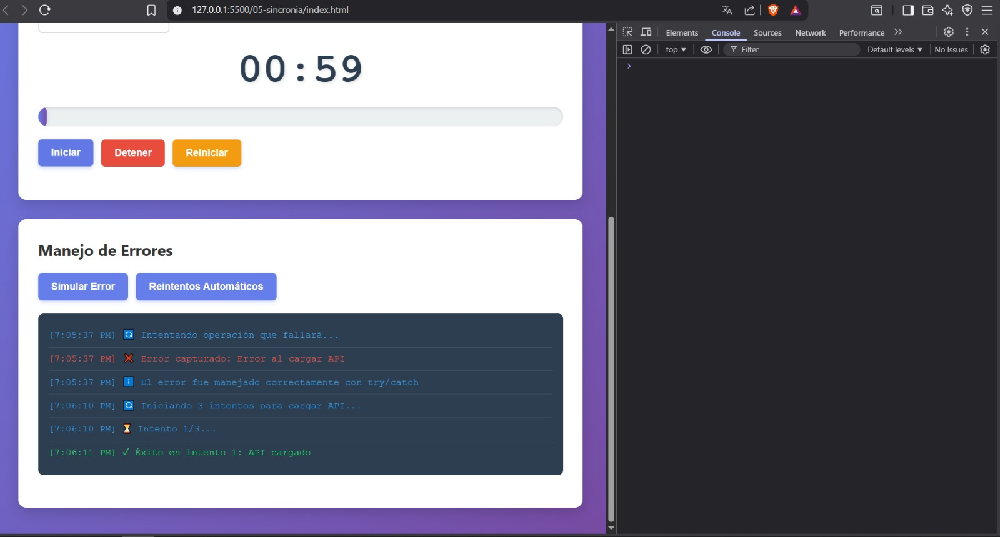
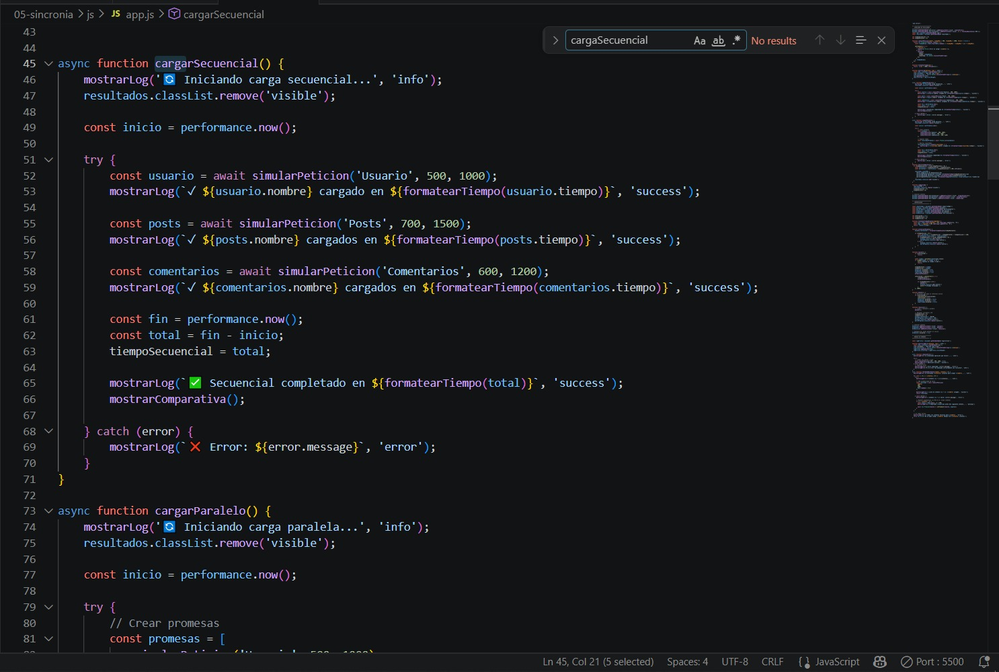

# Práctica 05 - Asincronía en JavaScript

## Información del Estudiante


---

## 1. Descripción breve del simulador implementado

La práctica implementa tres módulos independientes que demuestran el manejo de operaciones asíncronas en JavaScript. El primero es un simulador de carga de recursos que compara el rendimiento entre peticiones ejecutadas de forma secuencial y paralela, usando `async/await` y `Promise.all` respectivamente. El segundo es un temporizador regresivo construido con `setInterval` que actualiza el display y la barra de progreso cada segundo. El tercero es un módulo de manejo de errores que demuestra el uso de `try/catch` y una estrategia de reintentos con backoff exponencial.

---

## 2. Fragmentos de código relevantes

### 2.1 Función que retorna una promesa con setTimeout

Cada petición simulada se construye como una promesa que se resuelve o rechaza después de un tiempo aleatorio. Esto permite simular el comportamiento de llamadas reales a una API.

```javascript
function simularPeticion(nombre, tiempoMin = 500, tiempoMax = 2000, fallar = false) {
  return new Promise((resolve, reject) => {
    const tiempoDelay = Math.floor(Math.random() * (tiempoMax - tiempoMin + 1)) + tiempoMin;

    setTimeout(() => {
      if (fallar) {
        reject(new Error(`Error al cargar ${nombre}`));
      } else {
        resolve({
          nombre,
          tiempo: tiempoDelay,
          timestamp: new Date().toLocaleTimeString()
        });
      }
    }, tiempoDelay);
  });
}
```

### 2.2 Carga secuencial con await consecutivos

Las tres peticiones se ejecutan una tras otra. Cada `await` detiene la ejecución hasta que la promesa anterior se resuelve, por lo que el tiempo total es la suma de los tres delays individuales.

```javascript
async function cargarSecuencial() {
    const inicio = performance.now();

    const usuario = await simularPeticion('Usuario', 500, 1000);
    mostrarLog(`✓ ${usuario.nombre} cargado en ${formatearTiempo(usuario.tiempo)}`, 'success');

    const posts = await simularPeticion('Posts', 700, 1500);
    mostrarLog(`✓ ${posts.nombre} cargados en ${formatearTiempo(posts.tiempo)}`, 'success');

    const comentarios = await simularPeticion('Comentarios', 600, 1200);
    mostrarLog(`✓ ${comentarios.nombre} cargados en ${formatearTiempo(comentarios.tiempo)}`, 'success');

    const total = performance.now() - inicio;
    tiempoSecuencial = total;
    mostrarComparativa();
}
```

### 2.3 Carga paralela con Promise.all

Las tres promesas se crean al mismo tiempo y se esperan juntas con `Promise.all`. El tiempo total equivale al delay más largo de los tres, no a la suma de todos.

```javascript
async function cargarParalelo() {
    const inicio = performance.now();

    const promesas = [
        simularPeticion('Usuario', 500, 1000),
        simularPeticion('Posts', 700, 1500),
        simularPeticion('Comentarios', 600, 1200)
    ];

    const resultadosPromesas = await Promise.all(promesas);

    resultadosPromesas.forEach((resultado) => {
        mostrarLog(`✓ ${resultado.nombre} cargado en ${formatearTiempo(resultado.tiempo)}`, 'success');
    });

    const total = performance.now() - inicio;
    tiempoParalelo = total;
    mostrarComparativa();
}
```

### 2.4 Manejo de errores con try/catch

Se llama a `simularPeticion` con el parámetro `fallar = true` para forzar el rechazo de la promesa. El bloque `catch` captura el error y lo muestra en la interfaz sin interrumpir la ejecución.

```javascript
async function simularError() {
  try {
    await simularPeticion('API', 500, 1000, true);
    mostrarLogError('✓ Operación exitosa', 'success');
  } catch (error) {
    mostrarLogError(`❌ Error capturado: ${error.message}`, 'error');
    mostrarLogError('ℹ️ El error fue manejado correctamente con try/catch', 'info');
  }
}
```

### 2.5 Temporizador con setInterval

El temporizador usa `setInterval` para decrementar el tiempo restante cada segundo. Cuando llega a cero se detiene automáticamente con `clearInterval` y muestra una alerta al usuario.

```javascript
intervaloId = setInterval(() => {
    tiempoRestante--;
    actualizarDisplay();

    if (tiempoRestante <= 0) {
        detener();
        display.classList.add('alerta');
        alert('⏰ ¡Tiempo terminado!');
    }
}, 1000);
```

---

## 3. Análisis de la diferencia entre carga secuencial y paralela

La carga secuencial ejecuta cada petición esperando que la anterior termine, por lo que el tiempo total es la suma de los tres delays individuales. En cambio, la carga paralela lanza las tres promesas al mismo tiempo y espera a que todas terminen con `Promise.all`, siendo el tiempo total equivalente únicamente al delay más largo de las tres peticiones.

En las pruebas realizadas, la carga secuencial tomó aproximadamente 2.63s mientras que la paralela completó en 1.06s, lo que representa una mejora del 59.8%. Esta diferencia se vuelve más significativa mientras mayor sea el número de peticiones independientes entre sí.

---

## 4. Capturas de la Aplicación

### 1. Estructura del proyecto


### 2. Carga secuencial


### 3. Carga paralela


### 4. Comparativa de tiempos


### 5. Temporizador funcionando


### 6. Manejo de errores


### 7. Consola limpia


### 8. Funciones async/await y Promise.all

