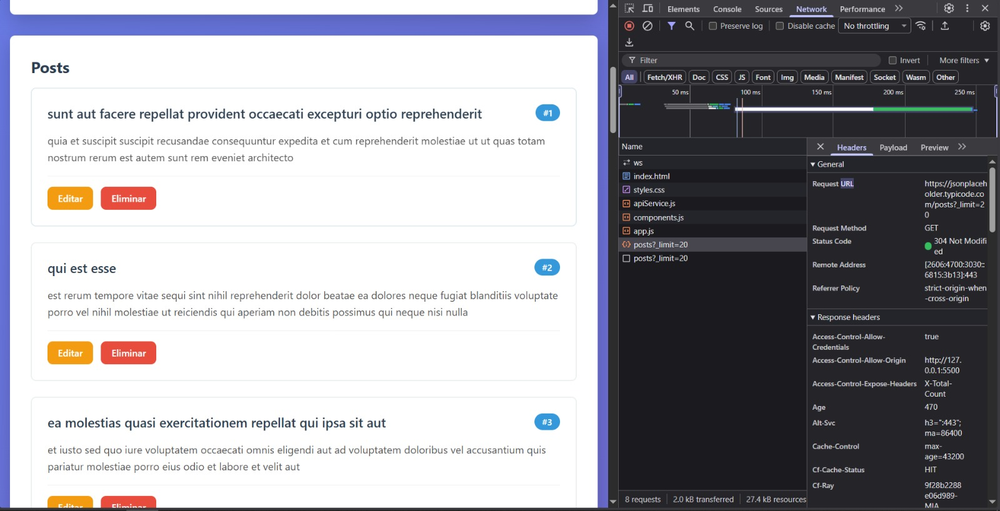
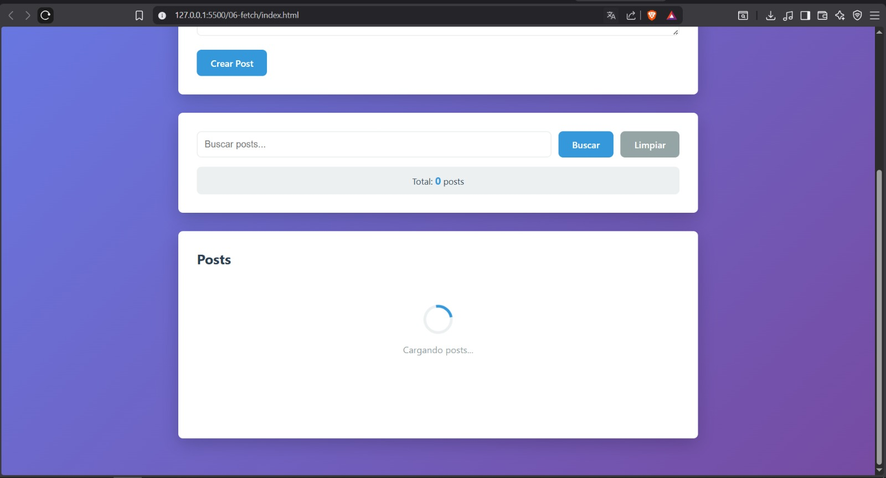
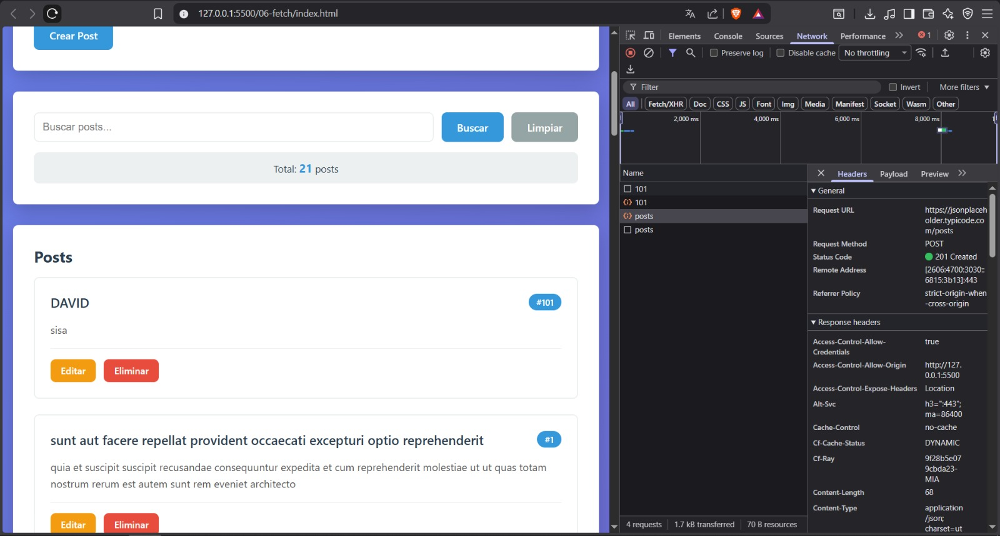
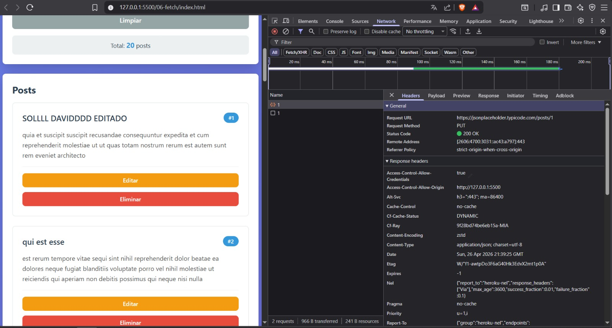
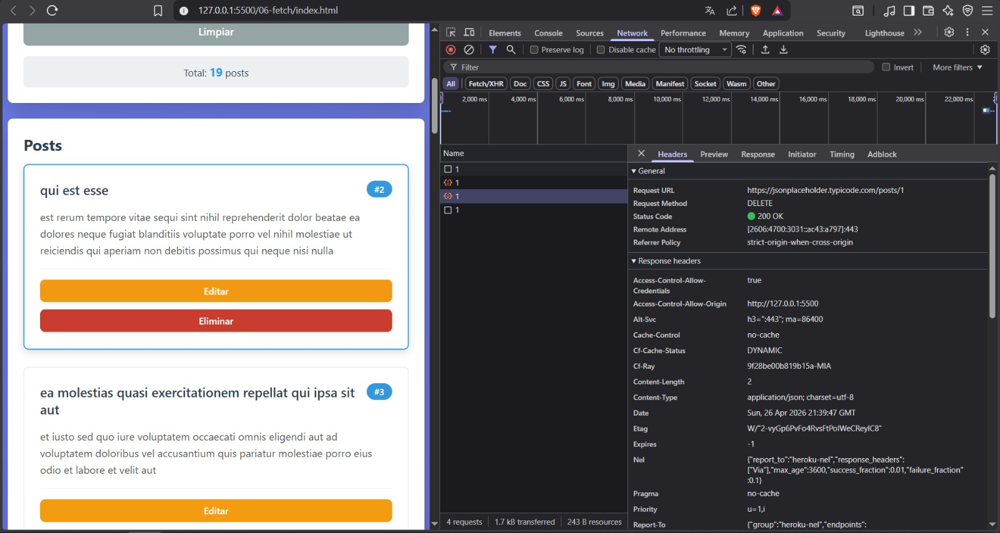
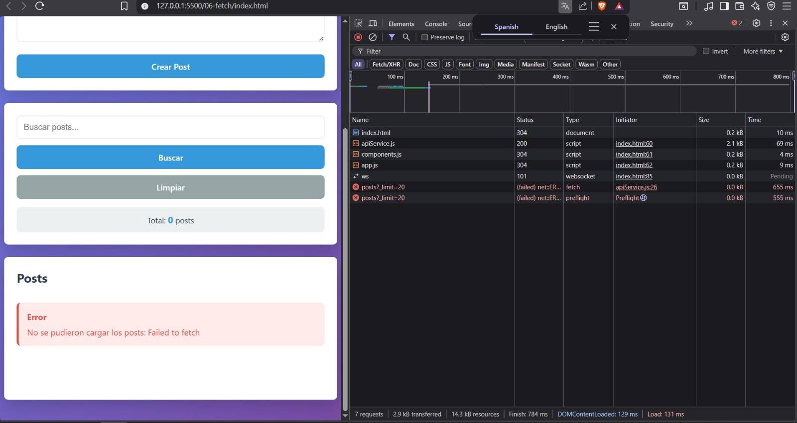
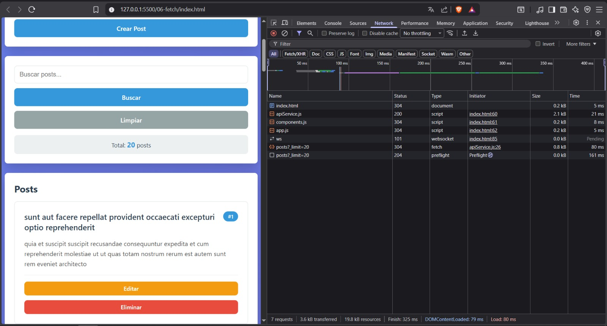
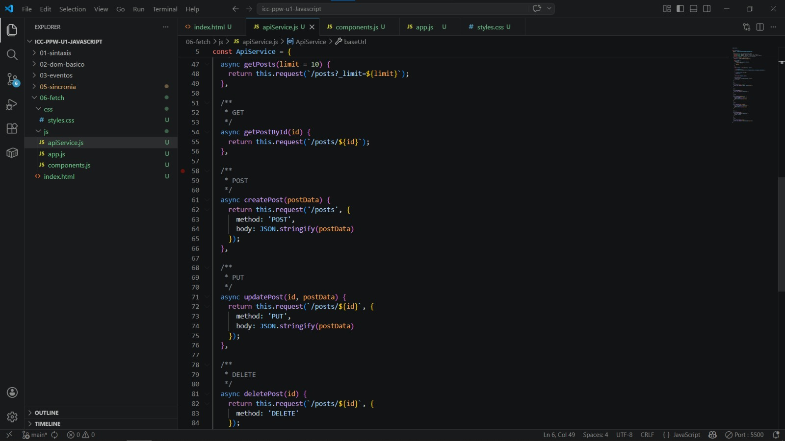

# Práctica 06 - Fetch API y Consumo de Servicios

## Información del Estudiante

| Campo    | Detalle                        |
|----------|--------------------------------|
| Nombre   | David Esteban Sisa Buestan     |
| Carrera  | Ingeniería en Sistemas         |
| Semestre | 5° semestre                    |

---

## 1. Descripción breve de la solución

La práctica implementa un gestor de posts completo que consume la API REST de JSONPlaceholder usando Fetch API nativa del navegador. La aplicación está dividida en tres módulos: `apiService.js` que centraliza todas las peticiones HTTP, `components.js` que construye los elementos del DOM usando `createElement` y `textContent` sin usar `innerHTML` para datos dinámicos, y `app.js` que gestiona el estado, los eventos y la lógica principal.

Se implementaron las cuatro operaciones CRUD: GET para cargar posts, POST para crear nuevos, PUT para actualizar existentes y DELETE para eliminarlos. Además se agregó un sistema de búsqueda local por título y contenido, un spinner de carga, mensajes de éxito y error temporales, y delegación de eventos para los botones generados dinámicamente.

---

## 2. Fragmentos de código relevantes

### 2.1 Función que retorna promesa con fetch

El método `request` del `ApiService` centraliza todas las peticiones HTTP. Verifica `response.ok` ya que fetch no lanza error en respuestas 4xx o 5xx, y maneja el caso de respuestas 204 sin body.

```javascript
async request(endpoint, options = {}) {
  const url = `${this.baseUrl}${endpoint}`;
  const config = {
    headers: {
      'Content-Type': 'application/json',
      ...options.headers
    },
    ...options
  };

  try {
    const response = await fetch(url, config);

    if (!response.ok) {
      throw new Error(`HTTP Error: ${response.status} ${response.statusText}`);
    }

    if (response.status === 204) {
      return null;
    }

    return await response.json();

  } catch (error) {
    console.error('Error en petición:', error);
    throw error;
  }
}
```

### 2.2 GET y POST con async/await

Se usan los métodos del servicio para cargar y crear posts. `getPosts` recibe un límite opcional y `createPost` envía los datos serializados como JSON.

```javascript
async getPosts(limit = 10) {
  return this.request(`/posts?_limit=${limit}`);
},

async createPost(postData) {
  return this.request('/posts', {
    method: 'POST',
    body: JSON.stringify(postData)
  });
}
```

### 2.3 PUT y DELETE

Ambos métodos reciben el ID en el endpoint. PUT reemplaza el post completo y DELETE lo elimina. Ambos verifican `response.ok` a través del método `request`.

```javascript
async updatePost(id, postData) {
  return this.request(`/posts/${id}`, {
    method: 'PUT',
    body: JSON.stringify(postData)
  });
},

async deletePost(id) {
  return this.request(`/posts/${id}`, {
    method: 'DELETE'
  });
}
```

### 2.4 Componente PostCard con createElement

Se construye cada tarjeta usando la API del DOM para evitar riesgos de XSS. Cada elemento se crea con `createElement`, el texto se asigna con `textContent` y se ensambla con `appendChild`.

```javascript
function PostCard(post) {
  const article = document.createElement('article');
  article.className = 'post-card fade-in';
  article.dataset.id = post.id;

  const title = document.createElement('h3');
  title.className = 'post-card-title';
  title.textContent = post.title;

  const body = document.createElement('p');
  body.className = 'post-card-body';
  body.textContent = post.body;

  const btnEliminar = document.createElement('button');
  btnEliminar.textContent = 'Eliminar';
  btnEliminar.dataset.action = 'eliminar';
  btnEliminar.dataset.id = post.id;

  article.appendChild(title);
  article.appendChild(body);
  return article;
}
```

### 2.5 Delegación de eventos

En lugar de registrar un listener por cada botón, se usa un único listener en el contenedor padre que detecta el `data-action` del elemento clickeado.

```javascript
listaPosts.addEventListener('click', (e) => {
  const action = e.target.dataset.action;
  if (!action) return;

  const id = parseInt(e.target.dataset.id);
  const post = posts.find(p => p.id === id);

  if (action === 'editar' && post) {
    activarModoEdicion(post);
  }

  if (action === 'eliminar') {
    eliminarPost(id);
  }
});
```

---

## 3. Capturas de la Aplicación

### Vista de posts cargados desde la API

**Descripción:** Se obtienen 20 registros desde JSONPlaceholder con GET. El contador muestra el total de posts cargados y cada tarjeta muestra título, contenido, ID y botones de acción.

### Spinner de carga

**Descripción:** Estado de carga visible mientras se realiza la petición GET inicial. El spinner se inserta con `createElement` y se elimina al completarse la carga.

### Post propio creado

**Descripción:** Formulario enviado con POST a JSONPlaceholder. El nuevo post aparece al inicio de la lista con el mensaje de confirmación verde.

### Post editado

**Descripción:** El formulario se rellena automáticamente al hacer clic en Editar. Tras confirmar, el post se actualiza en la lista mediante PUT.

### Post eliminado

**Descripción:** Tras confirmar el diálogo de confirmación, el post desaparece de la lista y el contador se actualiza. La operación usa DELETE.

### Mensaje de error

**Descripción:** Cuando la petición falla, se muestra un mensaje de error en rojo construido con `createElement`. El error nunca se muestra solo en consola sino siempre en la interfaz.

### DevTools Network

**Descripción:** Pestaña Network de DevTools mostrando las peticiones HTTP realizadas, con sus métodos, endpoints y códigos de estado.

### Código fuente

**Descripción:** Vista del `apiService.js` con los métodos GET, POST, PUT y DELETE implementados usando async/await y verificación de `response.ok`.