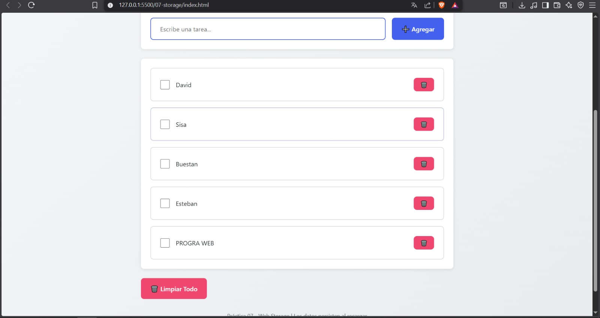
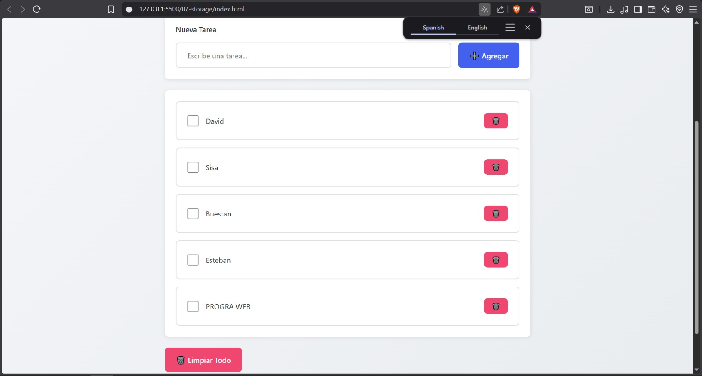
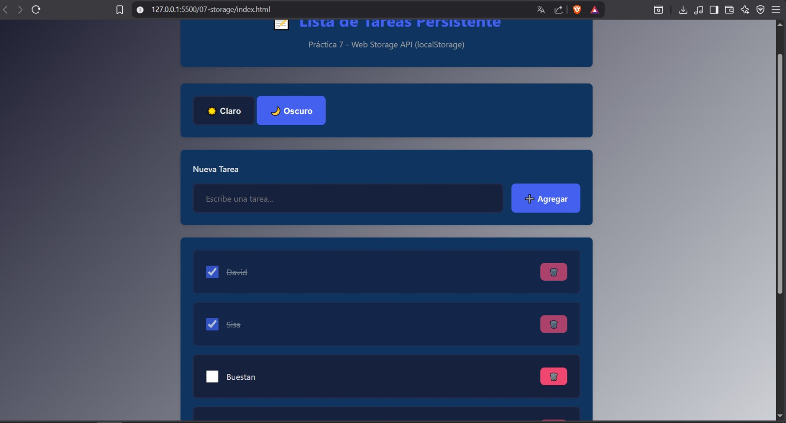
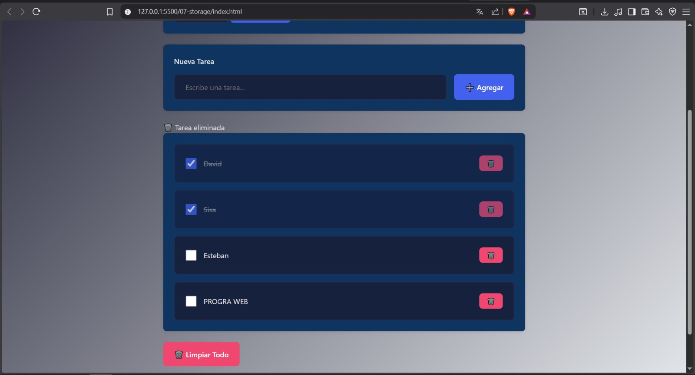
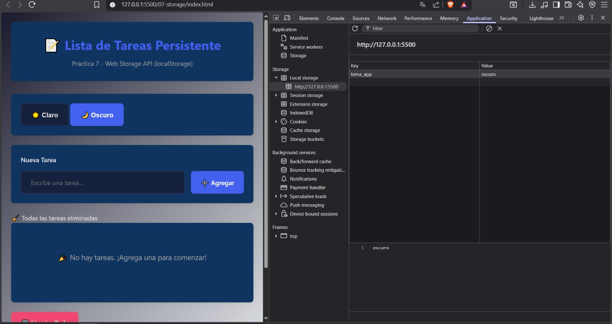
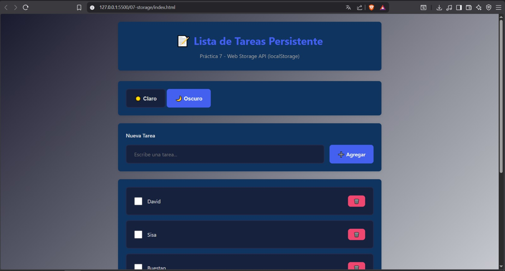
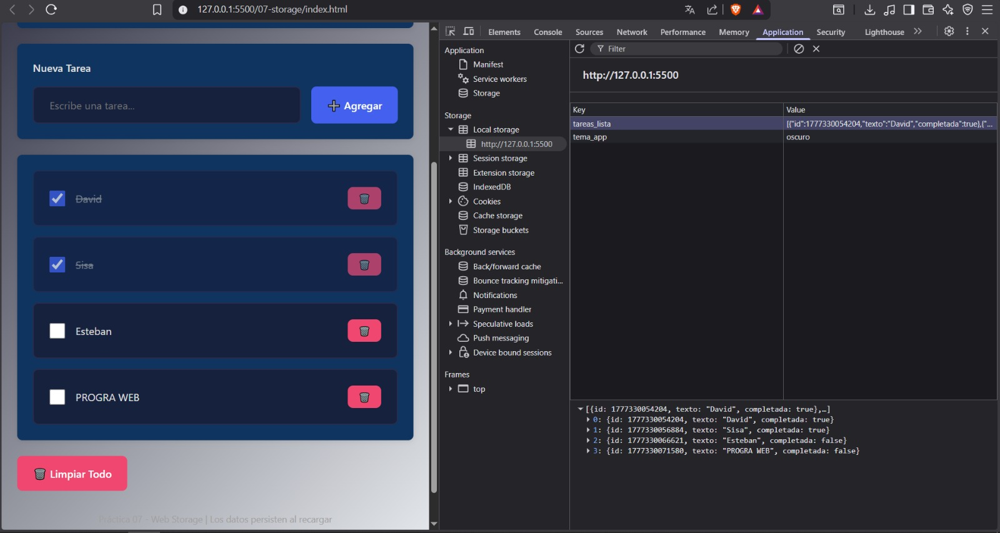
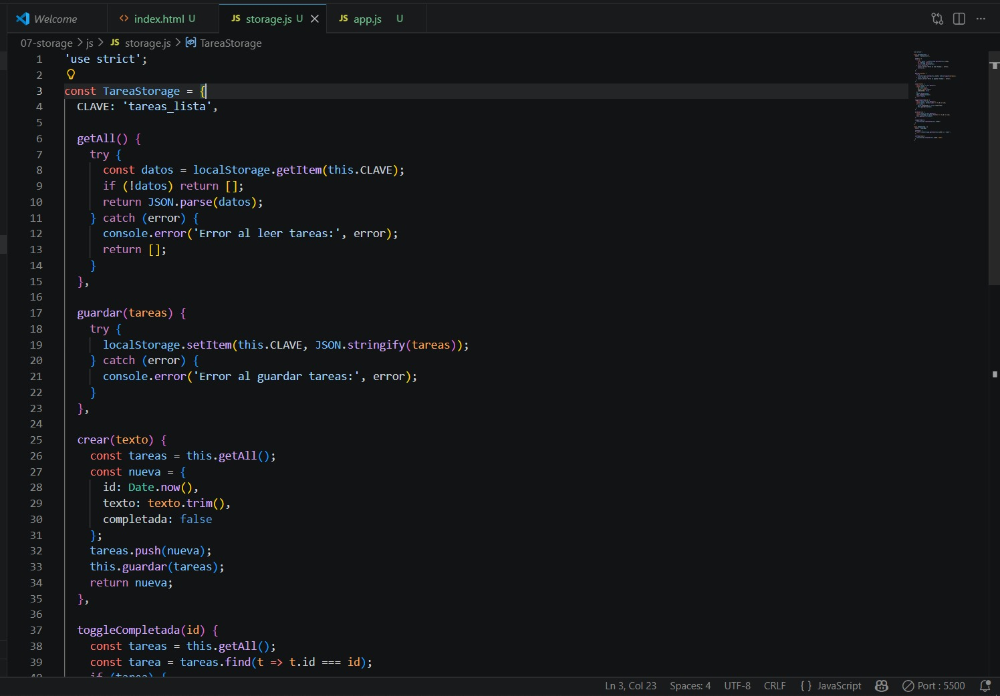

# Práctica 07 - Web Storage y Persistencia

## Información del Estudiante

---

## 1. Descripción breve de la solución

La práctica implementa una lista de tareas persistente usando Web Storage del navegador. La aplicación está dividida en dos módulos: `storage.js` que centraliza todas las operaciones de `localStorage` a través de dos servicios, `TareaStorage` para el CRUD de tareas y `TemaStorage` para la preferencia de tema, y `app.js` que gestiona el DOM, los eventos y la lógica de la interfaz.

Toda la construcción del DOM se realiza con `createElement` y `textContent` sin usar `innerHTML` para datos dinamicos, lo que evita vulnerabilidades XS. Los datos de tareas se serializan con `JSON.stringify` al guardar y se deserializan con `JSON.parse` al leer, garantizando que los objetos JavaScript se almacenen y recuperen correctamente desde `localStorage`.

---

## 2. Fragmentos de código relevantes

### 2.1 Servicio de Storage con patrón CRUD

El objeto `TareaStorage` encapsula todas las operaciones de `localStorage`. Esto centraliza el manejo de errores y los detalles de serialización en un solo lugar, haciendo el resto del código más limpio y reutilizable.

```javascript
const TareaStorage = {
  CLAVE: 'tareas_lista',

  getAll() {
    try {
      const datos = localStorage.getItem(this.CLAVE);
      if (!datos) return [];
      return JSON.parse(datos);
    } catch (error) {
      console.error('Error al leer tareas:', error);
      return [];
    }
  },

  guardar(tareas) {
    try {
      localStorage.setItem(this.CLAVE, JSON.stringify(tareas));
    } catch (error) {
      console.error('Error al guardar tareas:', error);
    }
  }
};
```

### 2.2 Crear y eliminar tarea con persistencia

Cada operación lee el estado actual desde `localStorage`, lo modifica y lo vuelve a guardar serializado. Esto garantiza que los datos nunca se pierdan entre operaciones.

```javascript
crear(texto) {
  const tareas = this.getAll();
  const nueva = {
    id: Date.now(),
    texto: texto.trim(),
    completada: false
  };
  tareas.push(nueva);
  this.guardar(tareas);
  return nueva;
},

eliminar(id) {
  const tareas = this.getAll();
  const filtradas = tareas.filter(t => t.id !== id);
  this.guardar(filtradas);
}
```

### 2.3 Toggle de completada

Busca la tarea por ID, invierte su propiedad `completada` y guarda el array actualizado. Este patrón de leer, modificar y guardar es la base de todas las operaciones de actualización en Web Storage.

```javascript
toggleCompletada(id) {
  const tareas = this.getAll();
  const tarea = tareas.find(t => t.id === id);
  if (tarea) {
    tarea.completada = !tarea.completada;
    this.guardar(tareas);
  }
}
```

### 2.4 Construcción del DOM con createElement

Se usa `createElement` y `textContent` en lugar de `innerHTML` para evitar XSS. Si el texto de la tarea contuviera código HTML malicioso, `textContent` lo escapa automáticamente.

```javascript
function crearElementoTarea(tarea) {
  const li = document.createElement('li');
  li.className = 'task-item';
  li.dataset.id = tarea.id;

  const span = document.createElement('span');
  span.className = 'task-item__text';
  span.textContent = tarea.texto;

  const btnEliminar = document.createElement('button');
  btnEliminar.className = 'btn btn--danger btn--small';
  btnEliminar.textContent = '🗑️';

  btnEliminar.addEventListener('click', () => eliminarTarea(tarea.id));

  li.appendChild(span);
  li.appendChild(btnEliminar);
  return li;
}
```

### 2.5 Persistencia del tema con TemaStorage

El tema seleccionado se guarda en `localStorage` y se recupera al iniciar la aplicación. Las variables CSS se modifican directamente en el elemento raíz del documento para cambiar el aspecto visual sin recargar la página.

```javascript
const TemaStorage = {
  CLAVE: 'tema_app',

  getTema() {
    return localStorage.getItem(this.CLAVE) || 'claro';
  },

  setTema(tema) {
    localStorage.setItem(this.CLAVE, tema);
  }
};

function aplicarTema(nombreTema) {
  if (nombreTema === 'oscuro') {
    document.documentElement.style.setProperty('--bg-primary', '#1a1a2e');
    document.documentElement.style.setProperty('--card-bg', '#0f3460');
  }
  TemaStorage.setTema(nombreTema);
}
```

---

## 3. Capturas de la Aplicación

### 1. Lista con datos creados

**Descripción:** Se agregaron varias tareas usando el formulario. Cada tarea se guarda en `localStorage` con `JSON.stringify` y aparece en la lista construida con `createElement`.

### 2. Persistencia al recargar

**Descripción:** Tras recargar la página, las tareas siguen visibles porque se recuperan automáticamente con `localStorage.getItem` y `JSON.parse` al inicializar la aplicación.

### 3. Tareas completadas

**Descripción:** Al marcar el checkbox, la propiedad `completada` se invierte con `toggleCompletada` y el cambio se persiste. Al recargar, las tareas siguen marcadas en el mismo estado.

### 4. Eliminar tarea

**Descripción:** Al presionar el botón eliminar y confirmar, la tarea se filtra del array con `filter` y el array actualizado se guarda de vuelta en `localStorage`.

### 5. Limpiar todas las tareas

**Descripción:** El botón "Limpiar Todo" llama a `localStorage.removeItem` para eliminar la clave completa. La lista queda vacía y se muestra el estado vacío.

### 6. Modo oscuro persistente

**Descripción:** Al cambiar al tema oscuro, se modifican las variables CSS del documento y el nombre del tema se guarda en `localStorage`. Al recargar, el tema oscuro se recupera y aplica automáticamente.

### 7. DevTools - Local Storage

**Descripción:** En DevTools → Application → Local Storage se ven las claves `tareas_lista` con el array de tareas serializado en JSON y `tema_app` con el tema guardado.

### 8. Código fuente

**Descripción:** Vista del `storage.js` mostrando los métodos `getAll`, `guardar`, `crear` y `toggleCompletada` del servicio `TareaStorage`, con el manejo de errores mediante `try/catch`.