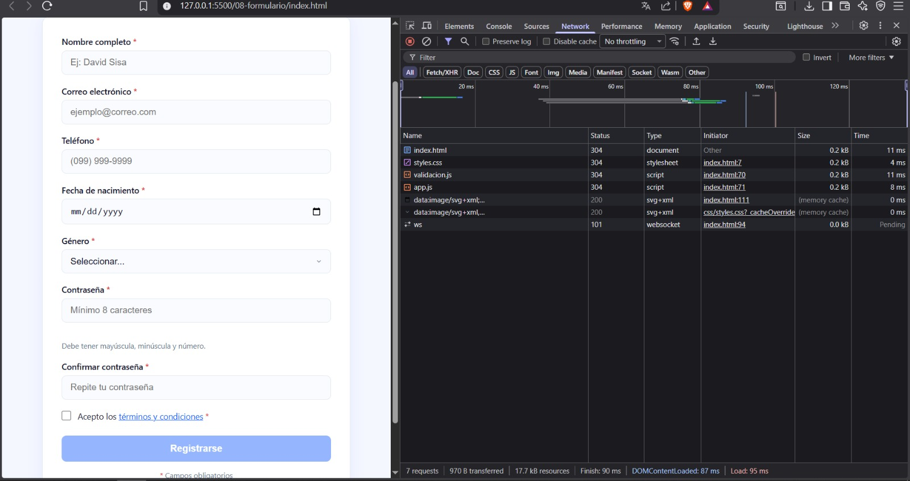
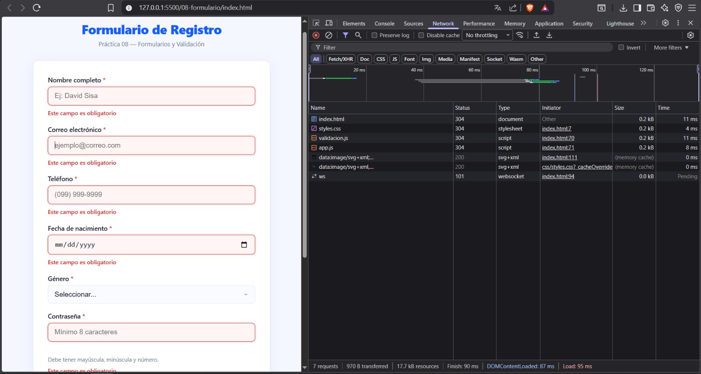
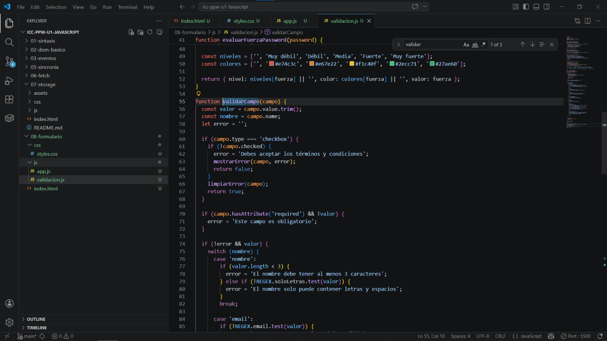
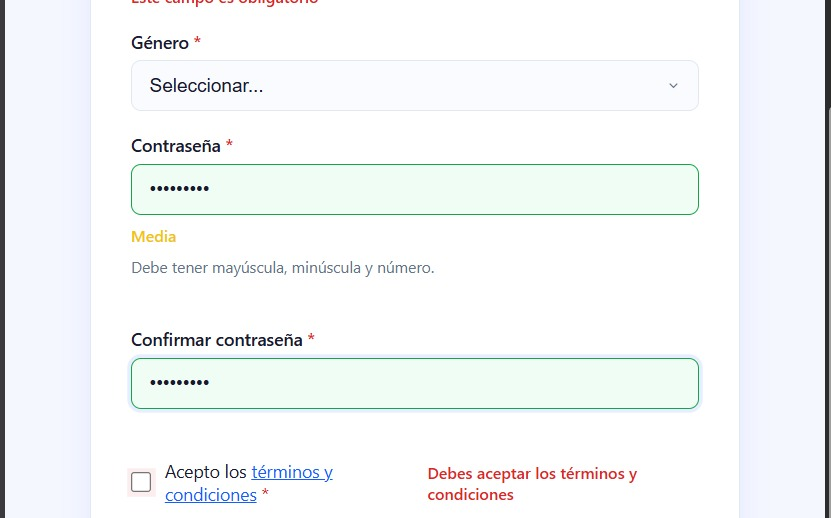
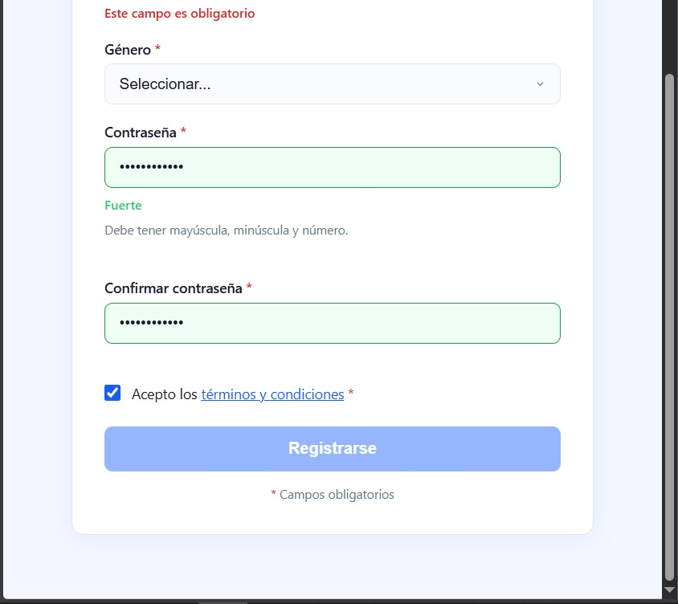
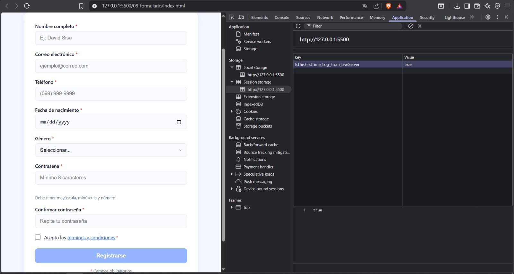
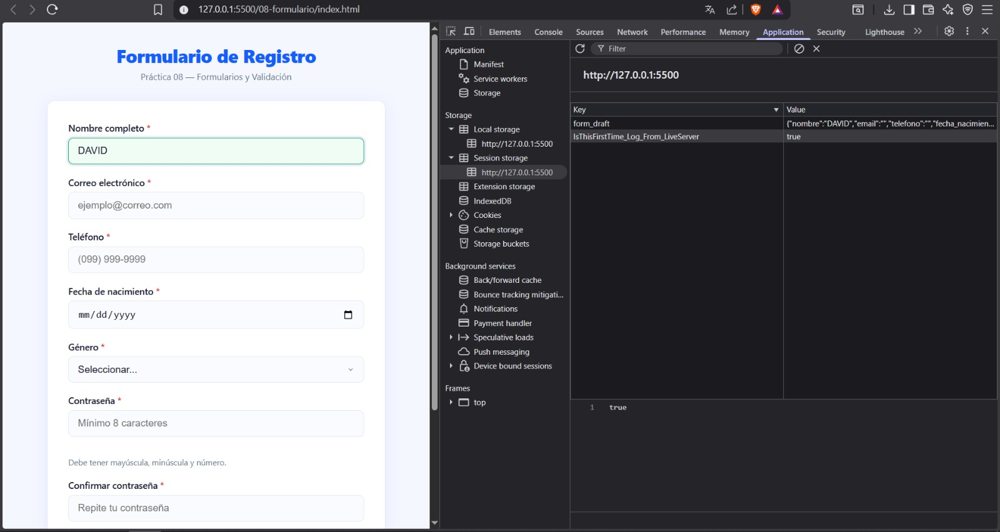

# Práctica 08 - Formularios 


## 1. Descripción breve 

La práctica implementa un formulario de registro con validación en tiempo real usando JavaScript puro. Se usó el atributo `novalidate` para desactivar la validación nativa del navegador y manejarla completamente con JavaScript. La lógica está dividida en dos módulos: `validacion.js` que contiene las funciones `validarCampo` y `validarFormulario` junto con el feedback visual, y `app.js` que gestiona los eventos del formulario, la máscara del teléfono, el indicador de fuerza de contraseña y el autoguardado con `sessionStorage`.

El formulario tiene 8 campos obligatorios: nombre, email, teléfono, fecha de nacimiento, género, contraseña, confirmación de contraseña y términos. Los datos se recopilan con `FormData` y `Object.fromEntries` al momento del envío.

---

## 2. Fragmentos de código 

### 2.1 Función `validarCampo` con validaciones por tipo

Valida un campo individual según su atributo `name`. Usa un `switch` para aplicar validaciones específicas con regex personalizadas para nombre, email, teléfono y contraseña.

```javascript
function validarCampo(campo) {
  const valor = campo.value.trim();
  const nombre = campo.name;
  let error = '';

  if (campo.hasAttribute('required') && !valor) {
    error = 'Este campo es obligatorio';
  }

  if (!error && valor) {
    switch (nombre) {
      case 'nombre':
        if (valor.length < 3) error = 'El nombre debe tener al menos 3 caracteres';
        else if (!REGEX.soloLetras.test(valor)) error = 'Solo letras y espacios';
        break;
      case 'email':
        if (!REGEX.email.test(valor)) error = 'Ingresa un correo electrónico válido';
        break;
      case 'password':
        if (valor.length < 8) error = 'La contraseña debe tener al menos 8 caracteres';
        else if (!/[A-Z]/.test(valor)) error = 'Debe contener al menos una mayúscula';
        else if (!/[0-9]/.test(valor)) error = 'Debe contener al menos un número';
        break;
    }
  }

  if (error) { mostrarError(campo, error); return false; }
  limpiarError(campo);
  return true;
}
```

### 2.2 Feedback visual con `mostrarError` y `limpiarError`

Agregan o quitan las clases CSS `campo--error` y `campo--valido` y crean dinámicamente el elemento de mensaje de error usando `createElement`.

```javascript
function mostrarError(campo, mensaje) {
  campo.classList.add('campo--error');
  campo.classList.remove('campo--valido');

  let errorDiv = campo.parentElement.querySelector('.error-mensaje');
  if (!errorDiv) {
    errorDiv = document.createElement('div');
    errorDiv.className = 'error-mensaje';
    campo.parentElement.appendChild(errorDiv);
  }
  errorDiv.textContent = mensaje;
}

function limpiarError(campo) {
  campo.classList.remove('campo--error');
  campo.classList.add('campo--valido');
  const errorDiv = campo.parentElement.querySelector('.error-mensaje');
  if (errorDiv) errorDiv.textContent = '';
}
```

### 2.3 Validación al perder foco y limpiar al escribir

Se usa `focusout` en lugar de `blur` porque burbujea, permitiendo delegación de eventos desde el formulario padre.

```javascript
form.addEventListener('focusout', (e) => {
  if (e.target.matches('input, select, textarea')) {
    validarCampo(e.target);
    actualizarBotonEnviar();
  }
});

form.addEventListener('input', (e) => {
  if (e.target.matches('input, select, textarea')) {
    if (e.target.classList.contains('campo--error')) {
      limpiarError(e.target);
    }
    autoguardar();
    actualizarBotonEnviar();
  }
});
```

### 2.4 Envío con `preventDefault` y `FormData`

Se cancela el comportamiento por defecto, se validan todos los campos y si pasan se recopilan los datos con `FormData` y `Object.fromEntries`.

```javascript
form.addEventListener('submit', (e) => {
  e.preventDefault();

  if (!validarFormulario(form)) {
    const primerError = form.querySelector('.campo--error');
    if (primerError) primerError.focus();
    return;
  }

  const datos = Object.fromEntries(new FormData(form));
  delete datos.confirmar_password;
  datos.terminos = form.querySelector('[name="terminos"]').checked;

  console.log('Datos del formulario:', datos);
  mostrarMensajeExito('¡Registro completado correctamente!');
  sessionStorage.removeItem('form_draft');
  form.reset();
});
```

### 2.5 Autoguardado con `sessionStorage`

Cada vez que el usuario escribe, los datos se serializan con `JSON.stringify` y se guardan en `sessionStorage`. Al cargar la página se restaura el borrador automáticamente.

```javascript
function autoguardar() {
  const datos = Object.fromEntries(new FormData(form));
  sessionStorage.setItem('form_draft', JSON.stringify(datos));
}

function restaurarBorrador() {
  const draft = JSON.parse(sessionStorage.getItem('form_draft'));
  if (!draft) return;
  Object.entries(draft).forEach(([name, value]) => {
    const campo = form.querySelector(`[name="${name}"]`);
    if (campo && campo.type !== 'password' && campo.type !== 'checkbox') {
      campo.value = value;
    }
  });
}
```

---

## 3. Capturas de la Aplicación

### 1. Formulario vacío

**Descripción:** Vista inicial del formulario con todos los campos vacíos y el botón "Registrarse" deshabilitado, ya que ningún campo obligatorio ha sido completado.

### 2. Errores de validación

**Descripción:** Al intentar enviar o al salir de cada campo vacío, se muestran los bordes rojos y los mensajes de error específicos generados con `createElement` y `textContent`.

### 3. Campos válidos

**Descripción:** Los campos correctamente completados muestran borde verde gracias a la clase `campo--valido` aplicada por la función `limpiarError`.

### 4. Fuerza de contraseña

**Descripción:** El indicador de fuerza se actualiza en tiempo real con el evento `input`. Muestra niveles desde "Muy débil" hasta "Muy fuerte" con colores distintos según la complejidad.

### 5. Confirmación de contraseña

**Descripción:** Cuando los campos de contraseña y confirmación no coinciden, se muestra el mensaje "Las contraseñas no coinciden" al perder el foco del segundo campo.

### 6. Envío exitoso

**Descripción:** Al pasar todas las validaciones, se muestra el mensaje de éxito en verde, el formulario se resetea y los datos se imprimen en la consola con `console.log`.

### 7. Autoguardado en sessionStorage

**Descripción:** DevTools → Application → Session Storage muestra la clave `form_draft` con los datos del formulario serializados en JSON, guardados automáticamente mientras el usuario escribe.

### 8. Código fuente

**Descripción:** Vista del `validacion.js` mostrando la función `validarCampo` con el switch de validaciones por tipo de campo y las funciones `mostrarError` y `limpiarError`.